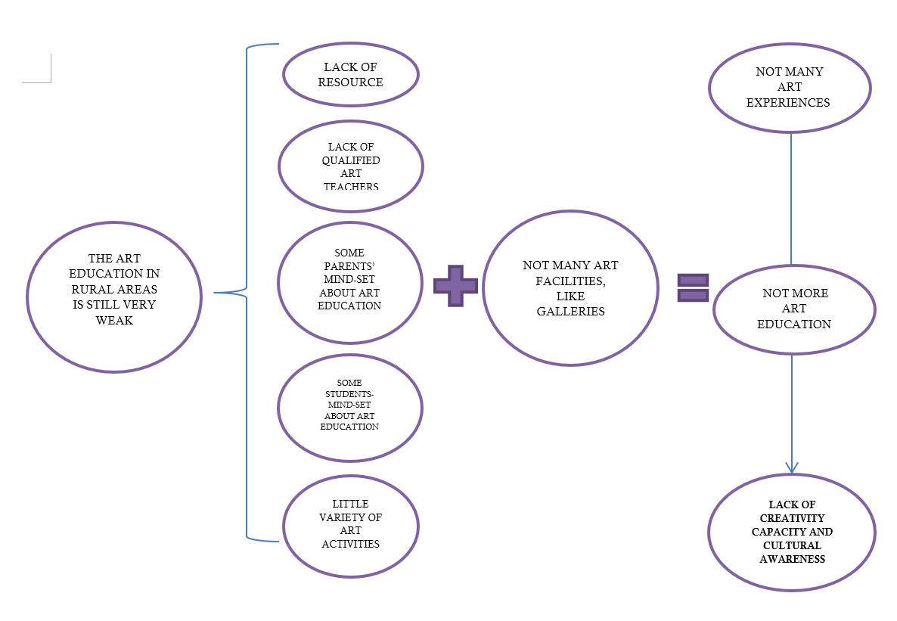

# ArtYourLife
ARTS EDUCATION:LEARNIG BY CREATING AND CO-CREATING WITH YOUR ART 

# Table of contents

- [1. PROBLEM.](#paragraph-1)
    - [1.1 Current art education in China.](#subparagraph-a)
    - [1.2	Developing the problem for a suitable solution based on the goals.](#subparagraph-b)
    
- [2.SOLUTION](#paragraph-2)
    - [2.1 The App name](#subparagraph-a)
    - [2.2 The functions.](#subparagraph-b) 
    - [2.3  ArtYourLife under the SDG Target](#subparagraph-c)
    - [2.4. Technological approach](#subparagraph-d)
    
- [3.PROTOTYPE](#paragraph-3)
    - [Subparagraph C](#subparagraph-c)
    - [Subparagraph D](#subparagraph-d)
    
- [4.USER SCENARIO](#paragraph-4)
 
- [5.EXPECTED IMPACT](#paragraph-5)

- [6.REFERNECES AND PICTURE ](#paragraph-6)

    
# 1. PROBLEM.
    
### 1.1 Current art education in China.

From the beginning of the 21st century, the Chinese government has promoted many policies for regulating different aspects of art education. So, the art education has gained a great attention in this country. 
However, this focus has been restricted to the urban schools. In the rural areas the art education is still very weak, especially in rural primary and secondary schools. There are some areas, such as in Guangxi, Qinghai, Gansu, Jiangxi, Henan and Hainan where Art field has not the same importance of the other disciplines. This condition depends on several aspects, such as: 
1) less resources invested in the development of art education, 
2) lack of qualified art teachers, 
3) some parents’ mind-set who put art education in the lowest level, 
4) some students’ ideas about the importance to study Art. Some of them believe art is nothing and they equate the art students with       the bad students. 
5) little variety of Art activities.

Also, in the rural areas there are museums where you can see classical art works (paintings, sculptures, etc.). However, the art galleries, where one can take part to the art exhibitions, are only in the urban area.  
These conditions involve two issues. First, people have not the opportunity to do many art experiences. Secondly, people have not the opportunity to get art education. 

  

### 1.2	Developing the problem for a suitable solution based on the goals.

Our goals:
1 Improving the art experiences
2 Developing and improving creativity of Chinese people in the rural area
3 Learning by seeing and by listening other creative works
4 Learning through the discussion on creative works
5 Developing the art education  
6 Building creativity capacity and cultural awareness

What is our ART FIELD?
There are several art fields. We can choose among several categories within this area. However instead of selecting some specific disciplines, we prefer to adopt the description given by the UNESCO about that:
“The arts should be gradually introduced to learners through artistic practices and experiences and maintain the value of not only the result of the process, but the process itself. Furthermore, since many art forms cannot be limited to one discipline, the interdisciplinary aspect of arts, and the commonalities among them, must be given more emphasis”.
Based on this concept, our App does not focus on a specific area of Art. We try to give more emphasis to the interdisciplinary disciplines. Our idea is to create an App allowing users:
1. showing and sharing their personal art forms. Users have a personal account in which they can express themselves, by upload their personal creations irrespective of the form of the expression. So, these works can fall within the music, dance, painting, drawing, etc.
2. co-creating something new through artistic practices and experiences. For example, we can regard some little games. The outcome of these games is a new collective creation. For each game, it is convenient to define both the rules and the challenges facing users. The game should have simple rules in order to avoid imposing many restrictions. Many limitations could discourage users (having an artistic talent) to take part to the game. 
3. discussing about personal and collective creations. This section would be organised based on some sub-categories that allow an effective development of learning skills.   

What are ART EXPERIENCES? 
1	These experiences allow users to build themselves, their opinions, their emotions, their lifestyle, etc.
2	These experiences allow users to create a tangible image of themselves by which they can communicate to others without fear to being      judged. 
3	These experiences allow users to express who they are without filters, in a direct way.

Why it is IMPORTANT TO do these art experiences?
1	Opportunity for learning through art. 
2	Opportunity for developing the creativity, 
3	Opportunity to explore ideas and arts-base solutions to problems in our world.

The relevance of the art experiences has been highlighted by the UNESCO
“Building creative capacity and cultural awareness for the 21st Century is both a difficult and a critical task, but one that cannot be eluded. All forces of society must be engaged in the attempt to ensure that the new generations of this century gain the knowledge and skills and, perhaps even more importantly, the values and attitudes, the ethical principles and the moral directions to become responsible citizens of the world and guarantors of a sustainable future”
Also, the artist Joseph Arthur summarizes the relevance of the creativity with the following words: 

“…To enlarge the idea of art 
to include the whole creativity.
 And if you do that, it follows
 logically that every living being 
is an artist – an artist in the sense 
that he can develop his own capacity.
 And therefore it's necessary at first
 that society cares about the 
educational system, that equality of
 opportunity for self-realization 
is guaranteed. “

Based on the above, we can formulate the following question:
How we can contribute to improve people’s creativity capacity and cultural awareness ?

# 2.	SOLUTION

The solution can be represented by an App on WeChat by which users can learn art through art experiences.

### 2.1 The App name.

We have chosen the name ArtYourLife because it consists in an App that allows users to shape their life using all their personal forms of expression. Imagination takes form through the most suitable types of expression chosen by users freely. 

### 2.2 The functions.

1 INDIVIDUAL CREATIVE WORKS
Individual creative work function helps users to express themselves by upload their individual works. 
In the first page, there is an icon about the personal profile of the user. By pressing on the icon, the user is addressed to him/her personal page where he/she can upload his/her personal works. Each user has a personal gallery that is organised based on chronological order. 
The works author can decide to share his/her creations with others or he/she can keep him/her works to himself/herself.

2 CO-CREATIVE WORKS
Co-creative works can be realised through several art experiences. We decide to use this tag because this App allows users to experiment a different approach, such as the use of the art through a co-creative process with other users who have the same art interest. The principle underling this function is the improvisation. The improvisation is the act of making or doing something with whatever is available at the time. Users work together to create something new, like new poetry, or a new drawing, etc. using their imagination in accordance with the rule of the art experiences. 
These experiences should allow participants learning in a passive way.

3 DISCUSSION
This function is providing for both the creation activities (individual and collaborative). The section of the discussion allows users learning in an active way. It is organised so as to stimulate the discussion based on several sub-categories, such as: look for the similarities with the artist work, look for the mistakes if the rules of the sonnet have not been complied with; guess the idea of the artist, etc.
   
### 2.3  ArtYourLife under the SDG Target
Our App falls within the Target N. 4. 
The link between Art education and Quality Education target has been highlighted by REID M. He said that:
“Thinking about Arts Education it can be uncomfortably common for arts learning to be left out of the conversation on high profile trends in education. It is the time for that to change. Arts Learning is an opportunity for students to explore ideas and arts-based solutions to problems in the worlds”. 
In other words: A comprehensive education includes learning in the arts.
The combination of these three activities should allow a progressive development of many abilities of the right side of the brain.

### 2.4. Technological approach 

1 For our project we use an App on WeChat. In China, WeChat is similar to WhatsApp. 
2 To access to the WeChat, it is necessary to have an account. Basically, many Chinese people use this Application. Foreign people can use this App if they have an account. 

# 3. PROTOTYPE 

# 4. USER SCENARIO

This App is for everyone who feels he/she has an artistic talent in every form. So, this App can be used by everyone without regard to age.
Our App is designed for users:
1 who are not professional artist  
2 who have created or want to make their works, but they are ashamed to show their creations because they consider themselves not         being able like professional artist.

Lihua is a 20-years-old man of Guangxi. He is calm and withdrawn. He is in the second year of his Bachelor in Computer Science at the Faculty of Guangxi. 
He likes to play with colours since he was a child. When he was 17 years old, he learned to decorate with oil paint during a summer school that focused on the teaching of the colours. He made some colourful and creative drawings. These creative works represent his way of being.  
He made many works thanks to his ability. He would like to pursue his passion and to learn new artistic disciplines. 
However he is studying Computer Science to get more opportunities to look for a job. Also, he has no time because he attends his university courses every day and he dedicates his week-end to study. 
He would like to show someone his drawings, just to receive some feedback. However, he does not know how he can show these works or whether there is some platform on line that allows him to upload his drawings.
Lihua has heard of the ArtYourLife App by his friend who follows an Art course at the University. So, he downloads the App and he creates a personal account. He discovers that in the personal page he can upload his drawings and all his works, in general. Also, by sifting through the App, he discovered that he can do some Art experiences. He tries to participate to one of those. He chooses “SEE FROM MONDRIAN’S EYES” because he is drowning to the colours. He can invite other users to play with him. He is happy because it can exercise other disciplines with other people. That is exactly what he wanted: to learn other art matter. Then, he discovers that he can discuss about the creative works with other users. So, Lihua started discussing about the similarities between their collaborative works and the Mondrian painting with other users.

# 5.	EXPECTED IMPACT 

We expect that our App will be used by people having an interest on Art. We consider that many people feel they have an artistic talent. This is most likely to be apparent to the people living in rural areas, because of the little opportunities to access to the Art. So, they want to have something that can be the means to communicate. Contrary, people who have access to the Art opportunities may underestimate the purposes of the App.
We expect a graduation about the users of our App over time. The young people will be braver than old people to use this platform to show and improve their creativity.
The range of the people from 24 to 35 years feels enticed to use this platform in respect of the popularity reached in the first two years. 
From the 5th year, we expect that a large number of interested people from 36 years and over could use our App, still on the popularity reached in the first four years.

# 6.	REFERENCES AND PICTURE  

Reid, M. (2017). Arts Education and the SDGs, available at http://www.teachsdgs.org/blog/arts-education-and-the-sdgs (last access 17.07.2019).
UNESCO, Road Map for Art Education - The World Conference on Arts Education: Building Creative Capacities for the 21st Century, Lisbon, 6-9 March 2006, available at http://www.unesco.org/new/fileadmin/MULTIMEDIA/HQ/CLT/CLT/pdf/Arts_Edu_RoadMap_en.pdf (last access 17.07.2019).
Zeng, H. J. (2016). A Survey on Chinese Rural Art Education. Higher Education of Social Science, 10(5), 41-44, available at: http://www.cscanada.net/index.php/hess/article/view/8452 DOI: http://dx.doi.org/10.3968/8452 (last access 17.07.2019)

